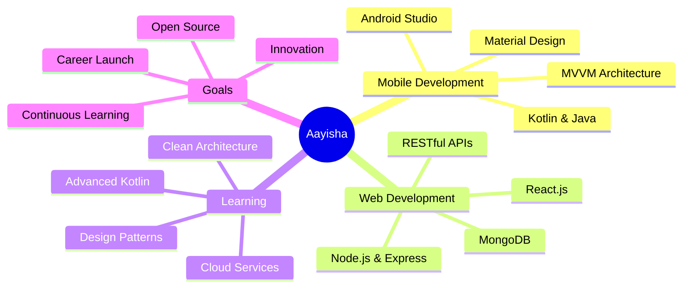

<div align="center">

<!-- Stylish Name Header with Gradient -->


</div>

<div align="center">

<!-- Animated Typing Effect -->
<p align="center">
  
</p>

<!-- Stylish Social Badges -->
<p align="center">
  <a href="https://linkedin.com/in/aayisha-o-s" target="_blank">
    
  </a>
  <a href="mailto:osaayisha314@gmail.com">
    
  </a>
  <a href="https://github.com/aayishaos" target="_blank">
    
  </a>
</p>

<!-- Profile Stats with Custom Styling -->
<p align="center">
  
  
  
</p>

</div>

---

<div align="center">

## 🌟 About Me

</div>

```typescript
const aayisha = {
    role: "Software Development Student",
    code: ["Java", "Kotlin", "JavaScript", "TypeScript"],
    askMeAbout: ["Android Dev", "MERN Stack", "API Design", "Mobile Apps"],
    technologies: {
        mobile: {
            android: ["Kotlin", "Java", "MVVM", "Material Design", "Jetpack"]
        },
        frontEnd: {
            js: ["React", "HTML5", "CSS3"],
            css: ["Tailwind CSS", "Material UI", "Bootstrap"]
        },
        backEnd: {
            js: ["Node.js", "Express"],
            databases: ["MongoDB", "MySQL", "PostgreSQL"]
        },
        devOps: ["Git", "GitHub", "Firebase", "AWS"],
        tools: ["Android Studio", "VS Code", "Postman", "Figma"]
    },
    currentStatus: "🚀 Building portfolio projects & seeking opportunities",
    funFact: "I debug with console.log and I'm not ashamed! 😄"
};
```

<div align="center">

### 💭 *"Code is like humor. When you have to explain it, it's bad."* – Cory House

</div>

---

<div align="center">

## 🛠️ Tech Stack & Tools

</div>

<div align="center">

### 📱 Mobile Development


### 🌐 Web Development (MERN Stack)


### 🎨 Frontend & Design


### 🗄️ Databases & Backend


### ☁️ Cloud & DevOps


</div>

---

<div align="center">

## 📊 GitHub Analytics

</div>

<div align="center">
  
  
</div>

<div align="center">
  
  
</div>

---

<div align="center">

## 🎯 Current Focus

</div>

<table align="center">
<tr>
<td align="center" width="33%">
  
### 📱 Android
Building scalable apps with modern architecture patterns (MVVM)
  
</td>
<td align="center" width="33%">
  
### 🌐 MERN Stack
Creating full-stack web applications with robust APIs
  
</td>
<td align="center" width="33%">
  
### 🚀 Portfolio
Developing real-world projects that solve actual problems
  
</td>
</tr>
</table>

<div align="center">



</div>

---

<div align="center">

## 🏆 Achievements & Highlights

</div>

<div align="center">

| 🎓 Education | 💡 Skills | 🚀 Status |
|:---:|:---:|:---:|
| Software Development Student | Android + MERN Stack | Available for Opportunities |
| Final Year | 10+ Technologies Mastered | Building Portfolio Projects |
| Strong Foundation | Full-Stack Capabilities | Ready to Contribute |

</div>

---

<div align="center">

## 📫 Let's Connect & Collaborate

<!--  -->

</div>

<div align="center">

### 🤝 I'm Open To

</div>

<table align="center">
<tr>
<td align="center" width="25%">

<br/>
<b>Internships</b>
<br/>
<sub>Mobile & Web Dev</sub>
</td>
<td align="center" width="25%">

<br/>
<b>Full-Time Roles</b>
<br/>
<sub>Entry Level Positions</sub>
</td>
<td align="center" width="25%">

<br/>
<b>Collaborations</b>
<br/>
<sub>Open Source Projects</sub>
</td>
</tr>
</table>

---

<div align="center">

## 💌 Get In Touch

<table>
  <tr>
    <td align="center" width="50%">
      <a href="mailto:osaayisha314@gmail.com">
        
      </a>
      <br/>
      <sub>💼 For professional inquiries & opportunities</sub>
    </td>
    <td align="center" width="50%">
      <a href="https://linkedin.com/in/aayisha-o-s">
        
      </a>
      <br/>
      <sub>🤝 Let's network & build together</sub>
    </td>
  </tr>
</table>

### ⚡ Quick Response Guaranteed | 🌟 Open to Discuss Ideas | 💡 Always Learning

</div>

---

<div align="center">

### 💭 Philosophy

*"The only way to do great work is to love what you do."*

**Currently:** 🎯 Building | 📚 Learning | 🚀 Growing | 💡 Innovating

</div>

---


<div align="center">

### 🌈 *Passionate Developer | Problem Solver | Team Player | Quick Learner*

<sub>Made with 💙 and lots of ☕</sub>

</div>
